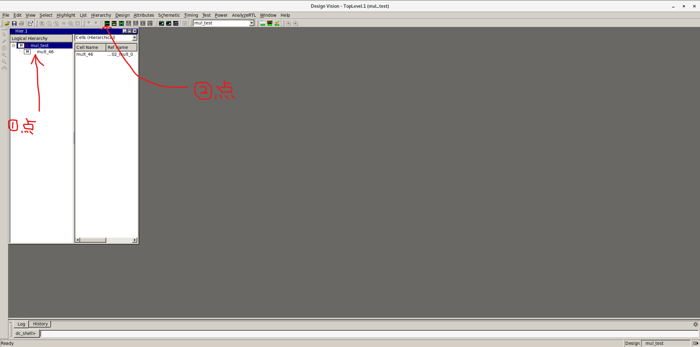
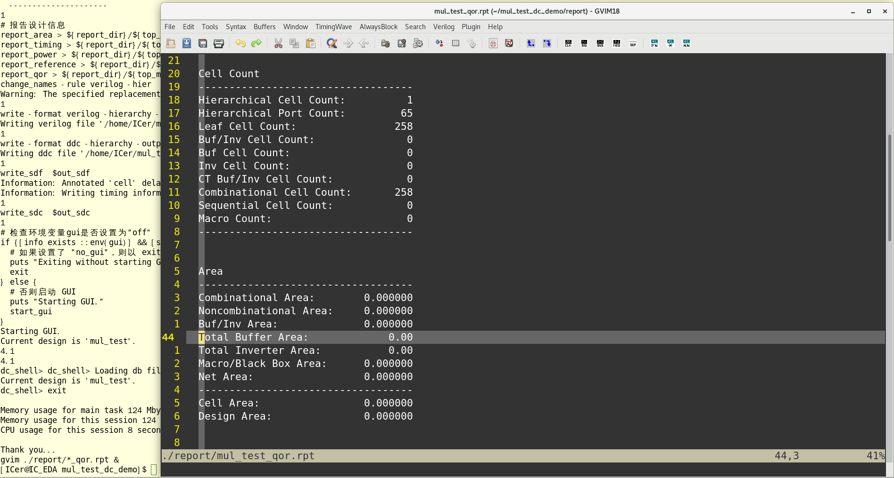

# auto_dc_run说明文档

## 前言

我一直有做三个auto脚本的需求，分别是auto_testbench、auto_dc_run和auto_fm_check，分别用来解决三个问题：

- auto_testbench：dut的快速编译、仿真和出波形，能够在初期完成代码质量和功能的初步收敛，避免简单问题拖到后面影响整体进度；

- auto_dc_run：dut的快速简单综合，用以确认一些代码和结构的可综合性以及初步评估面积和时序逻辑深度；

- auto_fm_check：进行两个dut（非网表）的一致性检查，主要在后期有rtl级的代码微调（比如lint修正）时快速对比下修改前后fm结果是否一致，避免问题扩散；

auto_testbench经过几版迭代后已经比较成熟，auto_fm_check还在本地开发（简单dut修改后比对已经调试pass，但是带着库的还没搞清楚）。auto_dc_run今天基本调试完成，因此先将这个脚本进行共享。

auto_dc_run的最原始需求，是之前在社区里写的一篇文章，里面放了一个Quartus II跑出来的网表，然后有朋友问“怎么能快速的得到这样的网表呢”？回答当然很简单，如果有FPGA工具那就在里面直接syn然后查看网表，如果有dc综合环境就在把需要的代码搞进去然后跑一下综合看网表。而后在开发auto_testbench的过程中，受其思路影响我觉得如果能有类似形式的脚本，直接针对dut生成一个简单的综合环境就好了，于是开始着手写auto_dc_run。

但是跑综合和仿真不一样，综合一般需要有库来支持。可是如果手里一穷二白啥也没有就想跑综合怎么办呢？也有办法就是使用synopsis自带的GTECH库gtech.db，它是dc的一个通用技术库，包含了一套理想化的、非工艺特定的基本逻辑门和单元。但是基于这套库没有办法跑全套综合流程（因为没有实际的工艺库嘛），所以跑出来的结果一定是有很多信息空缺的。如果手头有可以用的工艺库，那么可以在生成的综合环境下进一步的拓展，脚本也支持这种情况。

## 工程路径

[auto_dc_run: 自动生成简单综合环境的脚本](https://gitee.com/gjm9999/auto_dc_run)

## 更新记录

| 时间         | 更新     | 说明                                         |
| ---------- | ------ | ------------------------------------------ |
| 2024/12/24 | 上传初版脚本 | 1.支持进行dc综合；<br>2.支持综合后打开逻辑图；<br>3.支持使用工艺库； |

## 功能列表

1.支持生成dc综合环境，进行综合；

2.支持综合后直接打开逻辑互连图；

3.支持使用工艺库进行综合；

## 使用说明

下载脚本于linux环境中，并修改其属性为可执行文件，之后键入：

```
${script_path}/auto_dc_run -f ${rtl_path}/${rtl_name}.v
```

之后根据提示进行综合即可。 

## 使用示例

脚本auto_dc_run同级目录下有mul_test.v，其代码如下：

```
module mul_test #(
  parameter WD = 16
)( /*AUTOARG*/
   // Outputs
   oup,
   // Inputs
   clk, rst_n, inp0, inp1
   );

// ----------------------------------------------------------------
// Interface declare
// ----------------------------------------------------------------
input clk;
input rst_n;

input  [WD -1:0]inp0;
input  [WD -1:0]inp1;
output [WD -1:0]oup;

// ----------------------------------------------------------------
// Wire declare
// ----------------------------------------------------------------

// ----------------------------------------------------------------
// AUTO declare
// ----------------------------------------------------------------
/*AUTOOUTPUT*/
/*AUTOINPUT*/
/*AUTOWIRE*/

assign oup = inp0 * inp1;

endmodule
```

### GTECH综合

在当前目录键入：

```
auto_dc_run -f mul_test.v
```

生成环境：

```
/home/ICer/gitee_path/auto_dc_run/src/auto_dc_run is work
||================================================================
|| Please: 
|| cd /home/ICer/mul_test_dc_demo 
|| make syn [gui=off/on] [db=off/130fast/130slow]
||================================================================
```

而后进入到/home/ICer/mul_test_dc_demo，并执行make syn gui=on，这个意思是综合后直接打开gui查看互连结构，执行命令后得到结果：



然后对着出来的结构图放大并双击感兴趣区域就可以了，能看看互连简单分析分析逻辑关系和级数：


退出并在dc_shell里键入exit后会退回工作界面，而后环境会自动打开qor.rpt以供查看初步综合的结果：



显然，面积呀或者时序信息就不要指望了，cell count倒是可以简单看下。或者进一步在log/result/report文件夹里查看更多的信息：

```
├── log
│   ├── command.log
│   ├── dc_syn.log
│   ├── default.svf
│   ├── MUL_TEST.mr
│   ├── mul_test-verilog.pvl
│   └── mul_test-verilog.syn
├── Makefile
├── report
│   ├── mul_test_area.rpt
│   ├── mul_test_power.rpt
│   ├── mul_test_qor.rpt
│   ├── mul_test_reference.rpt
│   └── mul_test_timing.rpt
├── result
│   ├── mul_test.db
│   ├── mul_test.sdc
│   ├── mul_test.sdf
│   └── mul_test.v
└── run.tcl
```

用dc自带的GTECH库目前就只能做到这一步。

### 真实库综合

那么如果你自己有db库就能有更多的信息可以看，如果手里没有也没关系，在生成综合环境时脚本往里放了两个130nm的库文件：130fast.db和130slow.db，这是我在网上找到的可学习使用的综合库（请勿商用，使用本脚本时默认接收该要求）。如果你用了和我同款的虚拟机，那在根目录也能找到其他的库文件，在此不细说了。这种情况下在/home/ICer/mul_test_dc_demo执行综合时可以键入：

```
make syn db=130slow
```

此时自动打开的qor里就能看到更加精确的信息比如最大逻辑深度、准确的cell count和面积（这个没有太大参考意义）了：

```
  Timing Path Group 'clk'
  -----------------------------------
  Levels of Logic:              19.00
  Critical Path Length:          4.02
  Critical Path Slack:          -3.02
  Critical Path Clk Period:      1.00
  Total Negative Slack:        -21.46
  No. of Violating Paths:       14.00
  Worst Hold Violation:          0.00
  Total Hold Violation:          0.00
  No. of Hold Violations:        0.00
  -----------------------------------


  Cell Count
  -----------------------------------
  Hierarchical Cell Count:          1
  Hierarchical Port Count:         65
  Leaf Cell Count:                471
  Buf/Inv Cell Count:              53
  Buf Cell Count:                   5
  Inv Cell Count:                  48
  CT Buf/Inv Cell Count:            0
  Combinational Cell Count:       471
  Sequential Cell Count:            0
  Macro Count:                      0
  -----------------------------------


  Area
  -----------------------------------
  Combinational Area:    11803.719683
  Noncombinational Area:     0.000000
  Buf/Inv Area:            653.499006
  Total Buffer Area:           174.83
  Total Inverter Area:         478.67
  Macro/Black Box Area:      0.000000
  Net Area:                  0.000000
  -----------------------------------
  Cell Area:             11803.719683
  Design Area:           11803.719683
```

其他更多的需求和修改，请自行在目录下的run.tcl里魔改。
