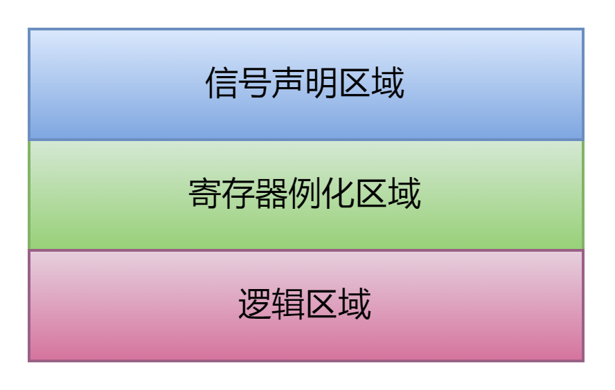

# auto_dff说明文档

## 前言

> 代码即注释，注释即代码。

我一直比较推崇围绕寄存器进行编码的RTL风格。这种风格典型的组织方式就像这样：

```
//信号声明
wire [8 -1:0]cnt_d;
wire [8 -1:0]cnt_q;
wire         cnt_en;
//寄存器例化
dffre #(.WIDTH(8))
u_cnt_dff(.clk(clk), .rst_n(rst_n), .d(cnt_d), .en(cnt_en), .q(cnt_q));
//可能有其他代码
...
//信号逻辑
assign cnt_en = case0 || case1;
assign cnt_d  = case0 ? 8'd0 : cnt_q + 1'b1;
```

某天实在是不想一行一行的自己来例化寄存器了，因此就做了这个脚本auto_dff.py。

## 工程路径

[auto_dff.py · 尼德兰的喵/myscript_python - Gitee.com](https://gitee.com/gjm9999/myscript_python/blob/master/auto_dff.py)

## 更新记录

| 时间        | 更新                                 | 说明  |
| --------- | ---------------------------------- | --- |
| 2024/1/29 | 1.分区域进行寄存器例化<br>2.支持always型寄存器例化方式 |     |

## 功能列表

1.通过注释进行寄存器例化；

## 使用说明

```
/*AUTO_DFF [位宽]信号名 = 初始值 寄存器类型名 END*/
           -可选-      --可选-- ---可选---
```

可选内容遵循一下规则：

```
说明1：位宽不写则默认为1
说明2：信号名必须写
说明3：初始值不写，则默认0
说明4：寄存器类型必须包含关键字dffre dffse dffve dffr dffe dff，推荐只维护dff dffr dffe dffre四种寄存器
说明5：寄存器类型不写默认dffre
说明6：寄存器类型名支持_crc _err _parity等后缀
```

脚本的使用方式为在.vimrc中添加：

```
command! DF  :execute '%! 你的路径/auto_dff.py -f %'
command! DFD :execute '%! 你的路径/auto_dff.py -d -f %'
```

之后在vim打开的文件中，通过:DF和:DFD插入和删除寄存器例化文件。

## 使用示例

### 寄存器例化

对于文件中的如下注释语句：

```
/*AUTO_DFF [INFO_WD]axi_info0=8'd10 dffre END*/
/*AUTO_DFF [6]axi_info1 dffve END*/
/*AUTO_DFF [$clog(WDD)]axi_info2 nova_dffe END*/
/*AUTO_DFF axi_info3  END*/
/*AUTO_DFF [$clog(WDD)+2] axi_info4 my_only_dffr END*/
/*AUTO_DFF axi_info5 this_dffr END*/
/*AUTO_DFF [$clog(WDD)*$clog(WDD)]axi_info6 = 0 this_dff END*/
```

:DF后会展开为：

```
/*AUTO_DFF [INFO_WD]axi_info0=8'd10 dffre END*/
//AUTO_DFF_START
wire [INFO_WD -1:0]axi_info0_d;
wire [INFO_WD -1:0]axi_info0_q;
wire               axi_info0_en;
wire [INFO_WD -1:0]axi_info0 = axi_info0_q;
dffre #(.WD(INFO_WD))
u_axi_info0_dff (
  .clk   (clk),
  .rst_n (rst_n),
  .d     (axi_info0_d),
  .q     (axi_info0_q),
  .en    (axi_info0_en));
//AUTO_DFF_END
/*AUTO_DFF [6]axi_info1 dffve END*/
//AUTO_DFF_START
wire [6 -1:0]axi_info1_d;
wire [6 -1:0]axi_info1_q;
wire         axi_info1_en;
wire [6 -1:0]axi_info1 = axi_info1_q;
dffve #(.WD(6), .VA({6{1'b0}}))
u_axi_info1_dff (
  .clk   (clk),
  .rst_n (rst_n),
  .d     (axi_info1_d),
  .q     (axi_info1_q),
  .en    (axi_info1_en));
//AUTO_DFF_END
/*AUTO_DFF [$clog(WDD)]axi_info2 nova_dffe END*/
//AUTO_DFF_START
wire [$clog(WDD) -1:0]axi_info2_d;
wire [$clog(WDD) -1:0]axi_info2_q;
wire                  axi_info2_en;
wire [$clog(WDD) -1:0]axi_info2 = axi_info2_q;
nova_dffe #(.WD($clog(WDD)))
u_axi_info2_dff (
  .clk   (clk),
  .d     (axi_info2_d),
  .q     (axi_info2_q),
  .en    (axi_info2_en));
//AUTO_DFF_END
/*AUTO_DFF axi_info3  END*/
//AUTO_DFF_START
wire [1 -1:0]axi_info3_d;
wire [1 -1:0]axi_info3_q;
wire         axi_info3_en;
wire [1 -1:0]axi_info3 = axi_info3_q;
dffre #(.WD(1))
u_axi_info3_dff (
  .clk   (clk),
  .rst_n (rst_n),
  .d     (axi_info3_d),
  .q     (axi_info3_q),
  .en    (axi_info3_en));
//AUTO_DFF_END
/*AUTO_DFF [$clog(WDD)+2] axi_info4 my_only_dffr END*/
//AUTO_DFF_START
wire [$clog(WDD)+2 -1:0]axi_info4_d;
wire [$clog(WDD)+2 -1:0]axi_info4_q;
wire                    axi_info4_en;
wire [$clog(WDD)+2 -1:0]axi_info4 = axi_info4_q;
my_only_dffr #(.WD($clog(WDD)+2))
u_axi_info4_dff (
  .clk   (clk),
  .rst_n (rst_n),
  .d     (axi_info4_d),
  .q     (axi_info4_q),
);
//AUTO_DFF_END
/*AUTO_DFF axi_info5 this_dffr END*/
//AUTO_DFF_START
wire [1 -1:0]axi_info5_d;
wire [1 -1:0]axi_info5_q;
wire         axi_info5_en;
wire [1 -1:0]axi_info5 = axi_info5_q;
this_dffr #(.WD(1))
u_axi_info5_dff (
  .clk   (clk),
  .rst_n (rst_n),
  .d     (axi_info5_d),
  .q     (axi_info5_q),
);
//AUTO_DFF_END
/*AUTO_DFF [$clog(WDD)*$clog(WDD)]axi_info6 = 0 this_dff END*/
//AUTO_DFF_START
wire [$clog(WDD)*$clog(WDD) -1:0]axi_info6_d;
wire [$clog(WDD)*$clog(WDD) -1:0]axi_info6_q;
wire                             axi_info6_en;
wire [$clog(WDD)*$clog(WDD) -1:0]axi_info6 = axi_info6_q;
this_dff #(.WD($clog(WDD)*$clog(WDD)))
u_axi_info6_dff (
  .clk   (clk),
  .d     (axi_info6_d),
  .q     (axi_info6_q),
);
//AUTO_DFF_END
```

### always手写寄存器例化

如果不是通过例化寄存器进行搭建，也可以以手写always块的形式进行生成，此时需要修改脚本：

```
class DFF:
  inst_type     = False   #True为例化形式
```

修改后重新生成为：

```
/*AUTO_DFF [INFO_WD]axi_info0=8'd10 dffre END*/
//AUTO_DFF_START
wire [INFO_WD -1:0]axi_info0_d;
wire [INFO_WD -1:0]axi_info0_q;
wire               axi_info0_en;
reg  [INFO_WD -1:0]axi_info0;
always @(posedge clk or negedge rst_n)begin
  if(!rst_n)
    axi_info0 <= 8'd10;
  else if(axi_info0_en)
    axi_info0 <= axi_info0_d;
end
assign axi_info0_q = axi_info0;
//AUTO_DFF_END
/*AUTO_DFF [6]axi_info1 dffve END*/
//AUTO_DFF_START
wire [6 -1:0]axi_info1_d;
wire [6 -1:0]axi_info1_q;
wire         axi_info1_en;
reg  [6 -1:0]axi_info1;
always @(posedge clk or negedge rst_n)begin
  if(!rst_n)
    axi_info1 <= {6{1'b0}};
  else if(axi_info1_en)
    axi_info1 <= axi_info1_d;
end
assign axi_info1_q = axi_info1;
//AUTO_DFF_END
/*AUTO_DFF [$clog(WDD)]axi_info2 nova_dffe END*/
//AUTO_DFF_START
wire [$clog(WDD) -1:0]axi_info2_d;
wire [$clog(WDD) -1:0]axi_info2_q;
wire                  axi_info2_en;
reg  [$clog(WDD) -1:0]axi_info2;
always @(posedge clk)begin
  if(axi_info2_en)
    axi_info2 <= axi_info2_d;
end
assign axi_info2_q = axi_info2;
//AUTO_DFF_END
/*AUTO_DFF axi_info3  END*/
//AUTO_DFF_START
wire [1 -1:0]axi_info3_d;
wire [1 -1:0]axi_info3_q;
wire         axi_info3_en;
reg  [1 -1:0]axi_info3;
always @(posedge clk or negedge rst_n)begin
  if(!rst_n)
    axi_info3 <= {1{1'b0}};
  else if(axi_info3_en)
    axi_info3 <= axi_info3_d;
end
assign axi_info3_q = axi_info3;
//AUTO_DFF_END
/*AUTO_DFF [$clog(WDD)+2] axi_info4 my_only_dffr END*/
//AUTO_DFF_START
wire [$clog(WDD)+2 -1:0]axi_info4_d;
wire [$clog(WDD)+2 -1:0]axi_info4_q;
reg  [$clog(WDD)+2 -1:0]axi_info4;
always @(posedge clk or negedge rst_n)begin
  if(!rst_n)
    axi_info4 <= {($clog(WDD)+2){1'b0}};
  else
    axi_info4 <= axi_info4_d;
end
assign axi_info4_q = axi_info4;
//AUTO_DFF_END
/*AUTO_DFF axi_info5 this_dffr END*/
//AUTO_DFF_START
wire [1 -1:0]axi_info5_d;
wire [1 -1:0]axi_info5_q;
reg  [1 -1:0]axi_info5;
always @(posedge clk or negedge rst_n)begin
  if(!rst_n)
    axi_info5 <= {1{1'b0}};
  else
    axi_info5 <= axi_info5_d;
end
assign axi_info5_q = axi_info5;
//AUTO_DFF_END
/*AUTO_DFF [$clog(WDD)*$clog(WDD)]axi_info6 = 0 this_dff END*/
//AUTO_DFF_START
wire [$clog(WDD)*$clog(WDD) -1:0]axi_info6_d;
wire [$clog(WDD)*$clog(WDD) -1:0]axi_info6_q;
reg  [$clog(WDD)*$clog(WDD) -1:0]axi_info6;
always @(posedge clk)begin
  axi_info6 <= axi_info6_d;
end
assign axi_info6_q = axi_info6;
//AUTO_DFF_END
```

### 分区域例化

脚本除了识别/\*AUTO_DFF  END\*/关键字外，还会识别/\*AUTO_DFF INSTWIRE\*/和/\*AUTO_DFF INSTREG\*/关键字，这两个关键词分别指明了“信号声明区域”和“寄存器例化区域”：



因此寄存器生成的代码遵循如下的规则：

```
#识别的关键词为 /*AUTO_DFF [WD]dff_inst=3'd2 moon_dffre_crc END*/
#最简单模式为 /*AUTO_DFF dff_inst END*/，表示1比特复位值为0的寄存器
#如果在文档中能够找到/*AUTO_DFF INSTWIRE*/则将所有的信号声明放在此处
#如果在文档中能够找到/*AUTO_DFF INSTREG*/则把所有的寄存器例化或always块放至于此处
#/*AUTO_DFF INSTREG*/必须在/*AUTO_DFF INSTWIRE*/后面，否则编译会有问题
#如果只有/*AUTO_DFF INSTREG*/，那么信号声明也都放在这里
#如果找不到对应的，则放在/*AUTO_DFF ... END*/下面
```

也就是说，一个/\*AUTO_DFF [WD]dff_inst=3'd2 moon_dffre_crc END\*/会生成两部分代码，分别是信号声明：

```
wire [WD -1:0]dff_inst_d;
wire [WD -1:0]dff_inst_q;
wire          dff_inst_en;
wire          dff_inst_crc;
```

和寄存器例化：

```
wire [WD -1:0]dff_inst = dff_inst_q;
moon_dffre_crc #(.WD(WD))
u_dff_inst_dff (
  .clk   (clk),
  .rst_n (rst_n),
  .d     (dff_inst_d),
  .q     (dff_inst_q),
  .en    (dff_inst_en),
  .dff_inst_crc (dff_inst_crc)
);
```

生成的寄存器不会生成在/\*AUTO_DFF [WD]dff_inst=3'd2 moon_dffre_crc END\*/下面，因此这个注释仅仅作为提示寄存器类型和复位值的注释而存在，可以自由的写在逻辑区域或者其他任何区域，作用就是提醒有一个寄存器做逻辑的时候别忘了：

```
/*AUTO_DFF [WD]dff_inst=3'd2 moon_dffre_crc END*/
assign dff_inst_d  = ....;
assign dff_inst_en = ....; 
```

### 附加信息

有时候我们的寄存器会有附加信息，比如说带着err、parity、ecc结果等校验信息，此时在“type”区域可以写成类似moon_dffr_err的形式，moon_为调用寄存器组的前缀名，dffr为寄存器的类型，err为附加信息。此时声明时会多声明一个dff_inst_err信号并将其连接在err接口上。

如果是手写寄存器的形式，那么只声明一个dff_inst_err信号，逻辑需要后面自己去做。
