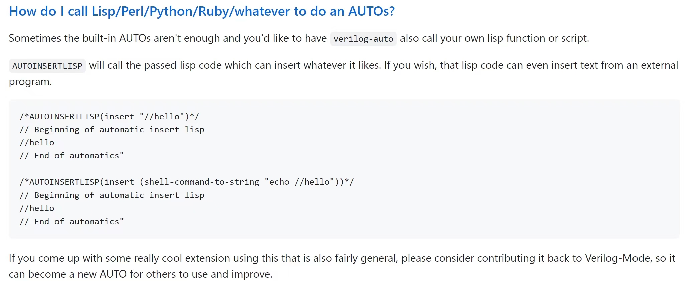

# local_verilog_mode说明文档

## 前言

verilog-mode是长久一来我一直使用的自动连线与例化工具，其开源工程地址为：

[https://github.com/veripool/verilog-mode.git](https://gitee.com/link?target=https%3A%2F%2Fgithub.com%2Fveripool%2Fverilog-mode.git)

例化在本地之后有嵌入脚本的需求，而verilog-mode本身也是支持嵌入脚本的：



但是我还是没能掌握合理的嵌入方式，于是还是选择走其他路径吧。

要嵌入的是哪些脚本呢？就是之前提过的auto_unflod.py、auto_dff.py、auto_assert.py等。在没有嵌入之前想在gvim中使用，是通过在.vimrc中添加代码而后以单独快捷键的方式实现的：

```
"you need change the path
command! L :execute '%! /home/ICer/gitee_path/rtl_note_script/src/gen_link.py -f %'
command! LD :execute '%! /home/ICer/gitee_path/rtl_note_script/src -d -f %'

command! U   :execute '%! /home/ICer/gitee_path/rtl_note_script/src/auto_unfold.py -f %'
command! UD  :execute '%! /home/ICer/gitee_path/rtl_note_script/src/auto_unfold.py -d -f %'

command! AS  :execute '%! /home/ICer/gitee_path/rtl_note_script/src/auto_assert.py %'

command! DF  :execute '%! /home/ICer/gitee_path/rtl_note_script/src/auto_dff.py -f %'
command! DFD :execute '%! /home/ICer/gitee_path/rtl_note_script/src/auto_dff.py -d -f %'
```

而如果嵌入到verilog-mode中，那么就可以在\e \r时一键执行。那么既然没有能力去动verilog-mode本身的结构，我选择在调用快捷键时嵌入其他脚本。

## 工程路径

https://gitee.com/gjm9999/local-verilog-mode

## 更新记录

| 时间       | 更新                                                                                  | 说明                                                                           |
| -------- | ----------------------------------------------------------------------------------- | ---------------------------------------------------------------------------- |
| 2024/2/1 | 1.增加了sim_start/sim_finish/sim_finish_pulse等控制逻辑<br>2.修改了仿真结束机制<br>3.修改了代码对齐不规整的严重问题 | 1.握手接口的驱动会在sim_start为1后进行<br>2.增加了在sim_finish为1的1000ns后结束仿真的线程<br>3.代码变更好看了！ |

## 功能列表


## 使用说明


## 使用示例
